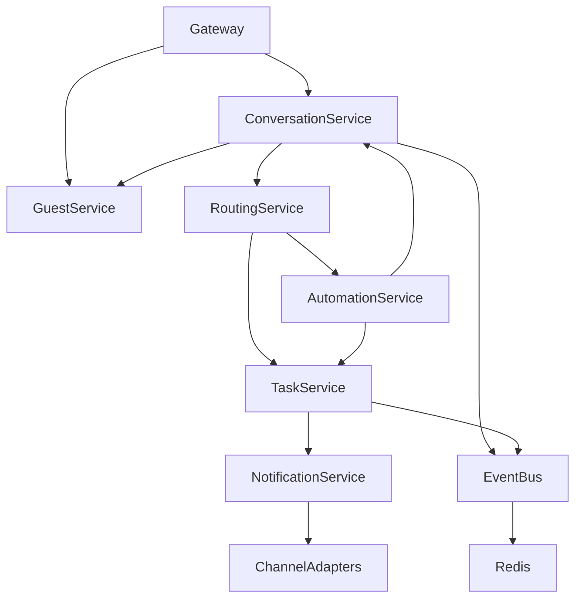

# Internal Services API

Internal service communication for Jack The Butler.

---

## Overview

Internal services communicate via:
- **Direct imports** - Within the same process
- **Redis pub/sub** - Cross-process events
- **HTTP** - Service-to-service calls (future microservices)

---

## Service Registry

### Core Services

| Service | Module | Responsibility |
|---------|--------|----------------|
| ConversationService | `@/services/conversation` | Conversation lifecycle |
| GuestService | `@/services/guest` | Guest profiles & memory |
| TaskService | `@/services/task` | Task management |
| RoutingService | `@/services/routing` | Message/task routing |
| NotificationService | `@/services/notification` | Staff notifications |
| AutomationService | `@/services/automation` | Scheduled actions |

### Infrastructure Services

| Service | Module | Responsibility |
|---------|--------|----------------|
| CacheService | `@/services/cache` | Redis caching |
| QueueService | `@/queue` | Job queue management |
| MetricsService | `@/utils/metrics` | Metrics collection |

---

## ConversationService

Manages conversation lifecycle and message flow.

### Interface

```typescript
interface ConversationService {
  // Lifecycle
  create(params: CreateConversationParams): Promise<Conversation>;
  close(conversationId: string, reason: CloseReason): Promise<void>;

  // Messages
  addMessage(conversationId: string, message: Message): Promise<Message>;
  getMessages(conversationId: string, options?: PaginationOptions): Promise<Message[]>;

  // State
  getActive(guestId: string): Promise<Conversation | null>;
  updateStatus(conversationId: string, status: ConversationStatus): Promise<void>;

  // Handoff
  escalateToStaff(conversationId: string, reason: string): Promise<void>;
  returnToAI(conversationId: string): Promise<void>;
}

interface CreateConversationParams {
  guestId: string;
  channel: ChannelType;
  channelIdentifier: string;
  initialMessage?: string;
  metadata?: Record<string, unknown>;
}

type ConversationStatus = 'active' | 'waiting' | 'escalated' | 'closed';
type CloseReason = 'resolved' | 'timeout' | 'guest_ended' | 'staff_ended';
```

### Events Emitted

| Event | Payload | When |
|-------|---------|------|
| `conversation.created` | `{ conversationId, guestId, channel }` | New conversation starts |
| `conversation.message` | `{ conversationId, message }` | Message added |
| `conversation.escalated` | `{ conversationId, reason, assignedTo }` | Escalated to staff |
| `conversation.closed` | `{ conversationId, reason, duration }` | Conversation ends |

### Usage Example

```typescript
import { conversationService } from '@/services/conversation';

// Create new conversation
const conversation = await conversationService.create({
  guestId: 'guest_123',
  channel: 'whatsapp',
  channelIdentifier: '+1234567890',
  initialMessage: 'Hi, I need help with my room'
});

// Add message
await conversationService.addMessage(conversation.id, {
  role: 'guest',
  content: 'Can I get late checkout?',
  timestamp: new Date()
});

// Escalate if needed
await conversationService.escalateToStaff(conversation.id, 'Complex request');
```

---

## GuestService

Manages guest profiles and preference memory.

### Interface

```typescript
interface GuestService {
  // CRUD
  findById(guestId: string): Promise<Guest | null>;
  findByChannel(channel: ChannelType, identifier: string): Promise<Guest | null>;
  create(params: CreateGuestParams): Promise<Guest>;
  update(guestId: string, updates: Partial<Guest>): Promise<Guest>;

  // Identification
  identify(channel: ChannelType, identifier: string): Promise<Guest>;
  merge(primaryId: string, secondaryId: string): Promise<Guest>;

  // Preferences
  getPreferences(guestId: string): Promise<GuestPreferences>;
  updatePreference(guestId: string, key: string, value: unknown): Promise<void>;
  learnPreference(guestId: string, interaction: InteractionContext): Promise<void>;

  // Stay context
  getCurrentStay(guestId: string): Promise<Stay | null>;
  getStayHistory(guestId: string): Promise<Stay[]>;
}

interface CreateGuestParams {
  name?: string;
  email?: string;
  phone?: string;
  channel: ChannelType;
  channelIdentifier: string;
}

interface GuestPreferences {
  explicit: Record<string, unknown>;  // Guest-stated preferences
  implicit: Record<string, unknown>;  // Learned preferences
  lastUpdated: Date;
}
```

### Events Emitted

| Event | Payload | When |
|-------|---------|------|
| `guest.created` | `{ guestId, channel }` | New guest identified |
| `guest.updated` | `{ guestId, changes }` | Profile updated |
| `guest.merged` | `{ primaryId, secondaryId }` | Profiles merged |
| `guest.preference.learned` | `{ guestId, preference }` | Preference inferred |

### Caching Strategy

```typescript
// Guest profiles cached for 1 hour
const GUEST_CACHE_TTL = 3600;

// Cache key pattern
const cacheKey = (guestId: string) => `guest:${guestId}`;

// Invalidation on update
async function updateGuest(guestId: string, updates: Partial<Guest>) {
  const guest = await db.update(guests).set(updates).where(eq(guests.id, guestId));
  await cache.del(cacheKey(guestId));
  return guest;
}
```

---

## TaskService

Manages task creation, assignment, and tracking.

### Interface

```typescript
interface TaskService {
  // CRUD
  create(params: CreateTaskParams): Promise<Task>;
  getById(taskId: string): Promise<Task | null>;
  update(taskId: string, updates: Partial<Task>): Promise<Task>;

  // Assignment
  assign(taskId: string, staffId: string): Promise<void>;
  unassign(taskId: string): Promise<void>;

  // Status
  start(taskId: string): Promise<void>;
  complete(taskId: string, resolution?: string): Promise<void>;
  cancel(taskId: string, reason: string): Promise<void>;

  // Queries
  getByConversation(conversationId: string): Promise<Task[]>;
  getByAssignee(staffId: string, status?: TaskStatus): Promise<Task[]>;
  getPending(department?: string): Promise<Task[]>;
  getOverdue(): Promise<Task[]>;
}

interface CreateTaskParams {
  conversationId: string;
  guestId: string;
  type: TaskType;
  title: string;
  description?: string;
  priority: Priority;
  department: string;
  dueAt?: Date;
  metadata?: Record<string, unknown>;
}

type TaskType =
  | 'service_request'
  | 'room_service'
  | 'maintenance'
  | 'housekeeping'
  | 'concierge'
  | 'complaint'
  | 'other';

type TaskStatus = 'pending' | 'assigned' | 'in_progress' | 'completed' | 'cancelled';
type Priority = 'low' | 'medium' | 'high' | 'urgent';
```

### Events Emitted

| Event | Payload | When |
|-------|---------|------|
| `task.created` | `{ taskId, type, priority, department }` | Task created |
| `task.assigned` | `{ taskId, staffId }` | Task assigned |
| `task.started` | `{ taskId, staffId }` | Work started |
| `task.completed` | `{ taskId, duration, resolution }` | Task done |
| `task.overdue` | `{ taskId, dueAt }` | SLA breached |

### SLA Monitoring

```typescript
// Check for overdue tasks every minute
const SLA_CHECK_INTERVAL = 60_000;

async function checkOverdueTasks() {
  const overdue = await taskService.getOverdue();

  for (const task of overdue) {
    await eventBus.emit('task.overdue', {
      taskId: task.id,
      dueAt: task.dueAt,
      overdueBy: Date.now() - task.dueAt.getTime()
    });
  }
}
```

---

## RoutingService

Routes messages and tasks to appropriate handlers.

### Interface

```typescript
interface RoutingService {
  // Message routing
  routeMessage(message: IncomingMessage): Promise<RouteDecision>;

  // Task routing
  routeTask(task: Task): Promise<StaffAssignment | null>;

  // Department lookup
  getDepartmentForIntent(intent: string): string;
  getAvailableStaff(department: string): Promise<Staff[]>;
}

interface RouteDecision {
  handler: 'ai' | 'staff' | 'automation';
  confidence: number;
  reason: string;
  staffId?: string;
  automationId?: string;
}

interface StaffAssignment {
  staffId: string;
  staffName: string;
  department: string;
  workload: number;
}
```

### Routing Logic

```typescript
async function routeMessage(message: IncomingMessage): Promise<RouteDecision> {
  const conversation = await conversationService.getById(message.conversationId);

  // If already escalated, route to assigned staff
  if (conversation.status === 'escalated' && conversation.assignedTo) {
    return {
      handler: 'staff',
      confidence: 1.0,
      reason: 'conversation_escalated',
      staffId: conversation.assignedTo
    };
  }

  // Check for automation triggers
  const automation = await automationService.matchTrigger(message);
  if (automation) {
    return {
      handler: 'automation',
      confidence: 0.95,
      reason: 'automation_matched',
      automationId: automation.id
    };
  }

  // Default to AI handling
  return {
    handler: 'ai',
    confidence: 0.9,
    reason: 'default_ai_handling'
  };
}
```

---

## NotificationService

Sends notifications to staff members.

### Interface

```typescript
interface NotificationService {
  // Send notifications
  notify(staffId: string, notification: Notification): Promise<void>;
  notifyDepartment(department: string, notification: Notification): Promise<void>;
  broadcast(notification: Notification): Promise<void>;

  // Preferences
  getPreferences(staffId: string): Promise<NotificationPreferences>;
  updatePreferences(staffId: string, prefs: Partial<NotificationPreferences>): Promise<void>;
}

interface Notification {
  type: NotificationType;
  title: string;
  body: string;
  priority: Priority;
  actionUrl?: string;
  data?: Record<string, unknown>;
}

type NotificationType =
  | 'task_assigned'
  | 'task_overdue'
  | 'escalation'
  | 'guest_message'
  | 'system_alert';

interface NotificationPreferences {
  channels: ('push' | 'email' | 'sms' | 'in_app')[];
  quietHours?: { start: string; end: string };
  priorities: Priority[];  // Which priorities to receive
}
```

### Delivery Channels

```typescript
async function deliverNotification(staffId: string, notification: Notification) {
  const prefs = await getPreferences(staffId);

  // Check quiet hours
  if (isQuietHours(prefs.quietHours) && notification.priority !== 'urgent') {
    await queueForLater(staffId, notification, prefs.quietHours.end);
    return;
  }

  // Deliver to all enabled channels
  const deliveries = prefs.channels.map(channel => {
    switch (channel) {
      case 'push':
        return pushService.send(staffId, notification);
      case 'email':
        return emailService.sendNotification(staffId, notification);
      case 'sms':
        return smsService.sendNotification(staffId, notification);
      case 'in_app':
        return websocketService.send(staffId, notification);
    }
  });

  await Promise.allSettled(deliveries);
}
```

---

## AutomationService

Handles scheduled and triggered automations.

### Interface

```typescript
interface AutomationService {
  // Triggers
  matchTrigger(context: TriggerContext): Promise<Automation | null>;

  // Execution
  execute(automationId: string, context: ExecutionContext): Promise<AutomationResult>;

  // Management
  create(automation: CreateAutomationParams): Promise<Automation>;
  update(automationId: string, updates: Partial<Automation>): Promise<Automation>;
  enable(automationId: string): Promise<void>;
  disable(automationId: string): Promise<void>;

  // Scheduling
  scheduleMessage(params: ScheduledMessageParams): Promise<string>;
  cancelScheduled(scheduleId: string): Promise<void>;
}

interface Automation {
  id: string;
  name: string;
  trigger: AutomationTrigger;
  actions: AutomationAction[];
  enabled: boolean;
  conditions?: AutomationCondition[];
}

type AutomationTrigger =
  | { type: 'schedule'; cron: string }
  | { type: 'event'; event: string; filters?: Record<string, unknown> }
  | { type: 'keyword'; keywords: string[] }
  | { type: 'intent'; intents: string[] };

type AutomationAction =
  | { type: 'send_message'; template: string; channel?: ChannelType }
  | { type: 'create_task'; taskParams: Partial<CreateTaskParams> }
  | { type: 'notify_staff'; department: string; message: string }
  | { type: 'webhook'; url: string; payload: Record<string, unknown> };
```

### Pre-built Automations

```typescript
// Check-in welcome message
const checkinWelcome: Automation = {
  id: 'auto_checkin_welcome',
  name: 'Check-in Welcome',
  trigger: { type: 'event', event: 'pms.checkin' },
  actions: [
    {
      type: 'send_message',
      template: 'welcome_checkin',
      channel: 'whatsapp'
    }
  ],
  enabled: true
};

// Pre-checkout reminder
const checkoutReminder: Automation = {
  id: 'auto_checkout_reminder',
  name: 'Checkout Reminder',
  trigger: {
    type: 'schedule',
    cron: '0 8 * * *'  // 8 AM daily
  },
  conditions: [
    { field: 'guest.checkoutDate', operator: 'eq', value: 'today' }
  ],
  actions: [
    {
      type: 'send_message',
      template: 'checkout_reminder'
    }
  ],
  enabled: true
};
```

---

## Event Bus

Internal event system for service communication.

### Interface

```typescript
interface EventBus {
  emit<T extends EventType>(event: T, payload: EventPayload<T>): Promise<void>;
  on<T extends EventType>(event: T, handler: EventHandler<T>): void;
  off<T extends EventType>(event: T, handler: EventHandler<T>): void;
  once<T extends EventType>(event: T, handler: EventHandler<T>): void;
}

// Event types
type EventType =
  | 'conversation.created'
  | 'conversation.message'
  | 'conversation.escalated'
  | 'conversation.closed'
  | 'guest.created'
  | 'guest.updated'
  | 'task.created'
  | 'task.assigned'
  | 'task.completed'
  | 'pms.checkin'
  | 'pms.checkout'
  | 'pms.room_change';
```

### Implementation

```typescript
import { Redis } from 'ioredis';
import { EventEmitter } from 'events';

class EventBus {
  private local = new EventEmitter();
  private redis: Redis;
  private subscriber: Redis;

  constructor(redisUrl: string) {
    this.redis = new Redis(redisUrl);
    this.subscriber = new Redis(redisUrl);

    // Subscribe to all events
    this.subscriber.psubscribe('events:*');
    this.subscriber.on('pmessage', (_pattern, channel, message) => {
      const event = channel.replace('events:', '');
      const payload = JSON.parse(message);
      this.local.emit(event, payload);
    });
  }

  async emit<T extends EventType>(event: T, payload: EventPayload<T>) {
    // Emit locally
    this.local.emit(event, payload);

    // Publish to Redis for cross-process
    await this.redis.publish(`events:${event}`, JSON.stringify(payload));
  }

  on<T extends EventType>(event: T, handler: EventHandler<T>) {
    this.local.on(event, handler);
  }
}

export const eventBus = new EventBus(process.env.REDIS_URL!);
```

---

## Service Dependencies



---

## Error Handling

All services use a consistent error pattern:

```typescript
import { AppError } from '@/errors';

class ServiceError extends AppError {
  constructor(
    public service: string,
    public operation: string,
    message: string,
    public cause?: Error
  ) {
    super(message, 'SERVICE_ERROR', 500);
  }
}

// Usage
async function findGuest(guestId: string) {
  try {
    return await db.query.guests.findFirst({ where: eq(guests.id, guestId) });
  } catch (error) {
    throw new ServiceError(
      'GuestService',
      'findById',
      `Failed to find guest ${guestId}`,
      error as Error
    );
  }
}
```

---

## Related

- [OpenAPI Spec](openapi.yaml) - Public API specification
- [Data Model](../../03-architecture/data-model.md) - Database schema
- [Tech Stack](../../03-architecture/tech-stack.md) - Technology choices
